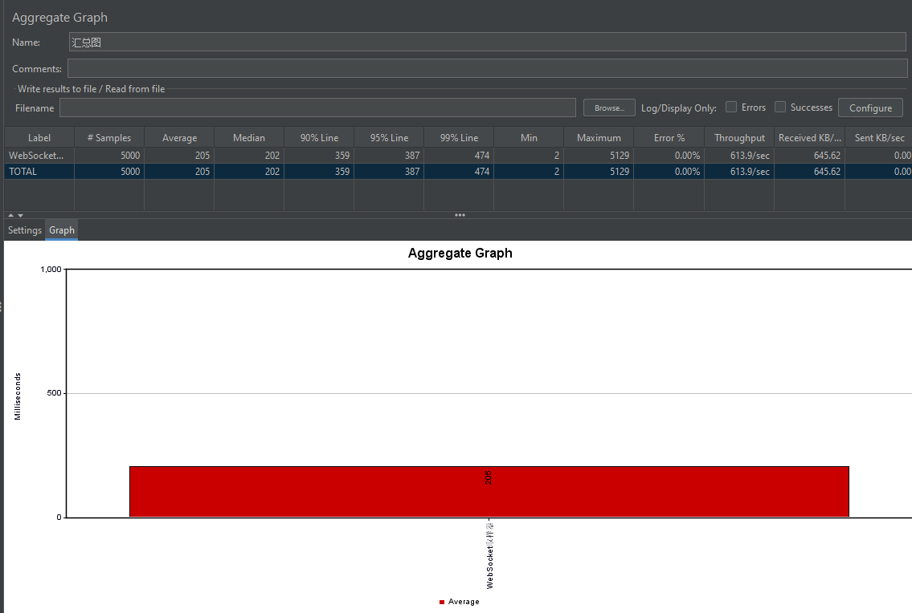
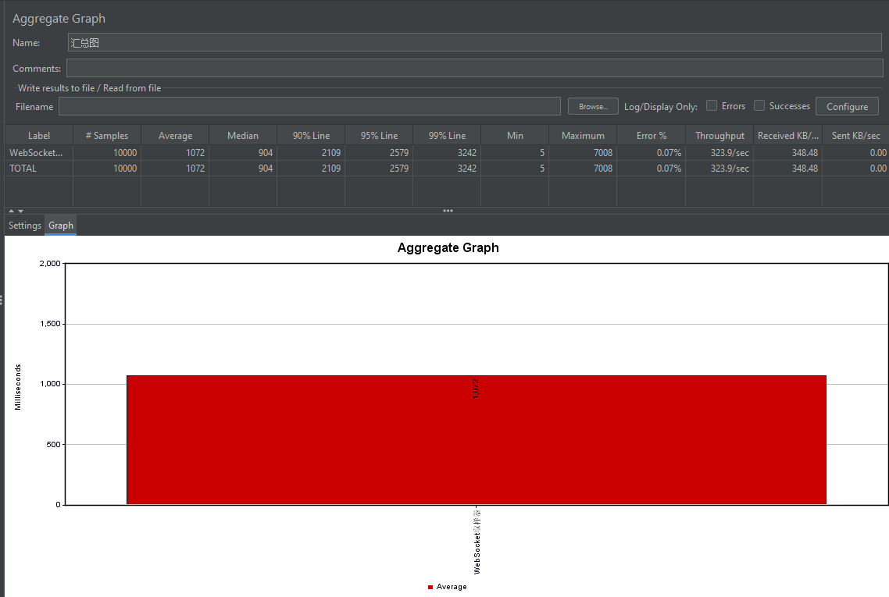
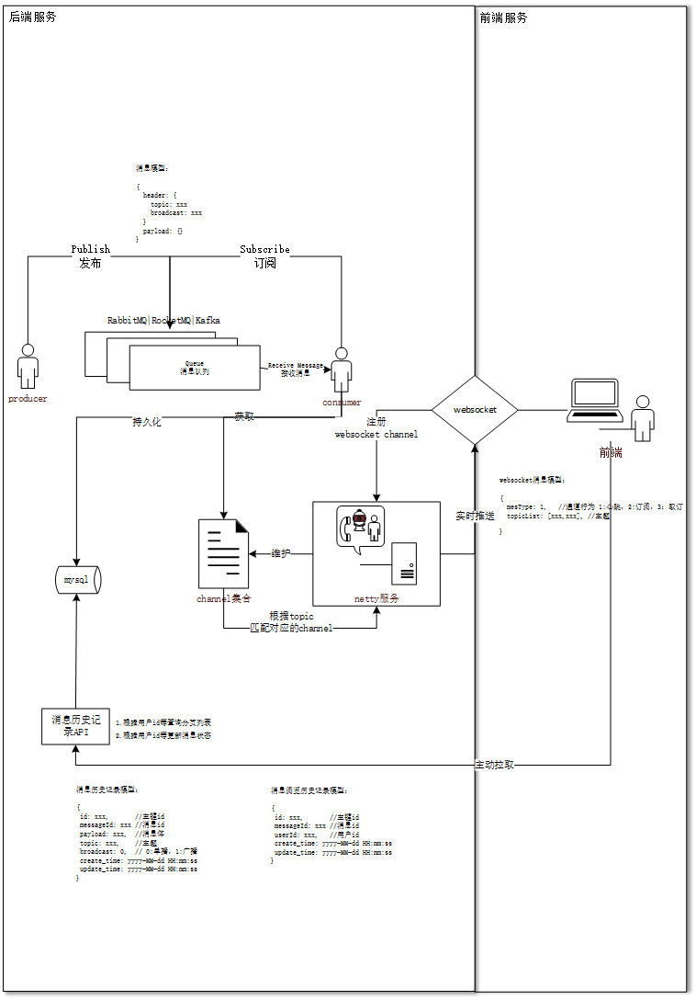
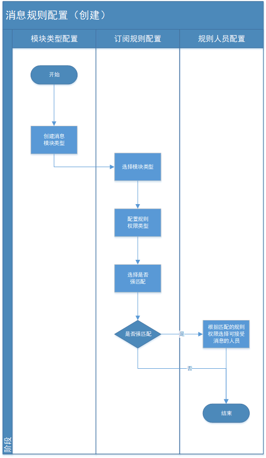
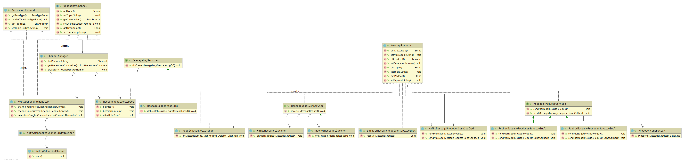
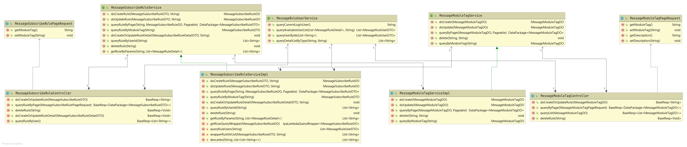
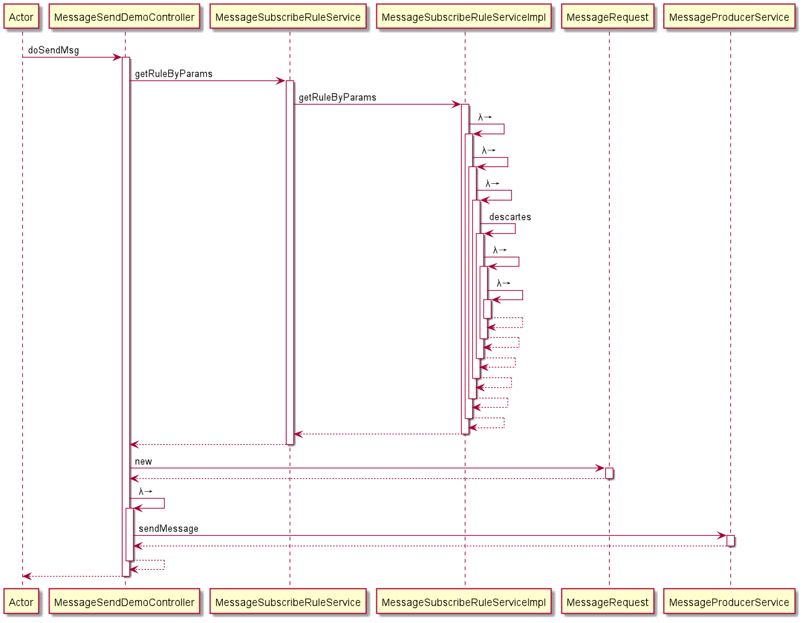
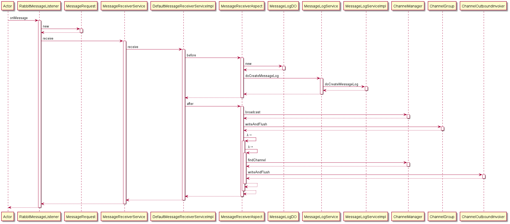
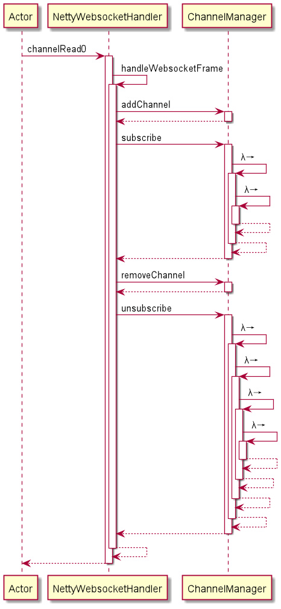

# message-notification

消息推送小组件，常用于“我的消息”功能。该组件依赖消息队列中间间实现消息的生产与监听消费，同时借助netty框架搭建websocket服务，实现消息的实时推送。该组件包含以下特性：
- 支持rabbitmq、rocketmq、kafka三种消息队列的切换
- 支持websocket心跳检测
- 支持消息历史记录、已读记录查询
- 支持消息订阅主题的自定义配置
- 支持消息幂等处理


## 目录 contents

[1. 开发指南](#1开发指南)
[2. 概要设计](#2概要设计)
[3. 详细设计](#3详细设计)
[4. 前后端接口文档](#4前后端接口文档)
[5. 附录](#5附录)


# 1.开发指南

请参考demo module

## 1.1 环境依赖
- mysql(或其它关系型数据库)
- 消息队列mq(rabbitmq|rocketmq|kafka)
- maven3
- jdk1.8

## 1.2 集成方式
### 1.2.1独立启动
该项目支持单独启动，[启动方式](##14 启动方式)
### 1.2.2项目集成
要使用maven，请将此依赖项添加到pom.xml中：
```
<dependency>
  <groupId>org.message</groupId>
  <artifactId>message-notification</artifactId>
  <version>${message.version}</version>
</dependency>
```

## 1.2 环境配置
该项目默认使用rabbitmq消息队列，websocket端口号8085，如需修改请参考application-message.yml配置文件。数据源配置请参考application-datasource.yml文件。

## 1.3 安装
执行初始化sql，参考[schema.sql](./demo/src/main/resources/db/schema.sql)脚本

## 1.4 启动方式
以springboot方式启动，示例如下：
```
  @TsieBootApplication
  public class WebRunSingleApplication implements ApplicationRunner {

  @Autowired
  private NettyWebsocketServer nettyWebsocketServer;

  public static void main(String[] args) {
  SpringApplication.run(WebRunSingleApplication.class, args);
  }

  @Override
  public void run(ApplicationArguments args) throws Exception {
  nettyWebsocketServer.start();
  }
  }
```

## 1.5 消息生产
消息生产首先要配置消息的主题，再调用消息发送接口，示例如下：
```
package org.message.demo.producer.impl;

import com.alibaba.fastjson.JSON;
import org.junit.jupiter.api.Test;
import org.message.SpringBootServerApplication;
import org.message.dto.MessageDTO;
import org.message.producer.MessageProducer;
import org.springframework.beans.factory.annotation.Autowired;
import org.springframework.boot.test.context.SpringBootTest;

import java.util.Date;
import java.util.HashMap;
import java.util.Map;

/**
 * <p>
 *
 * </p>
 *
 * @author WECENG
 * @since 2021/2/1 17:57
 */
@SpringBootTest(classes = SpringBootServerApplication.class)
public class MessageProducerServiceImplTest {

    @Autowired
    private MessageProducerService messageProducerService;

    @Test
    public void sendMessage() {
        MessageDTO messageDTO = new MessageDTO();
        messageDTO.setMessageId("123456111111");
        messageDTO.setTopic("789");
        messageDTO.setBroadcast(false);
        Map<String, Object> params = new HashMap<>();
        params.put("id", "id123123");
        params.put("title", "这是一条测试消息");
        params.put("creator", "创建人");
        params.put("createTime", new Date());
        messageDTO.setPayload(JSON.toJSONString(params));
        messageProducerService.sendMessage(messageDTO);
    }

}
```

[消息请求对象如下](#43-消息生产接口)

## 1.6 消息订阅

消息订阅采用websocket协议，websocket连接代码示例如下

[客户端]: message-demo/src/main/resources/static/websocket.html

```html
<!DOCTYPE html>
<html lang="en">
<head>
    <meta charset="UTF-8">
    <title>WSS 消息订阅测试页面</title>
</head>
<script>
    const wsUrl = "ws://127.0.0.1:8085/websocket"; // websocket 默认连接地址
    let websocket; // 用于存储实例化后websocket
    let needReconnect = false; // 连接成功过后需要设置发送间隔
    let websocketTimeout = 0; // 保存重连延迟函数
    const pingPong = {
        mesType: 'PINGPONG'
    }
    const subscribe = {
        mesType: 'SUBSCRIBE',
        topicList: ['topicA', 'topicB']
    }
    function mes(messageId)  {
        return{
            "messageId": messageId,
            "topic": "topicA",
            "broadcast": false,
            "payload": "消息内容"
        }
    }
    //设置心跳配置,定时发送信息，确保连接成功
    const heartCheck = {
        timeout: 3000, // 定时发送socket
        timeoutSend: 0, // 发送socket延迟函数
        serverTimeoutNumber: 0, //延迟关闭连接
        reset() {
            this.clear();
            this.start();
        },
        start() { // socket连接发送
            const self = this;
            this.timeoutSend = window.setTimeout(() => {
                if (websocket) {
                    websocket.send(JSON.stringify(pingPong));
                    self.serverTimeoutNumber = window.setTimeout(() => {
                        if (websocket) {
                            websocket.close();
                        }
                    }, self.timeout);
                }
            }, this.timeout);
        },
        clear() { //清除定时器
            clearTimeout(this.timeoutSend);
            clearTimeout(this.serverTimeoutNumber);
        },
    }

    /**
     * 连接websocket
     * @param url 连接地址
     * @returns
     */
    function openSocket(url = "") {
        if (!url) {
            url = wsUrl;
        }
        websocket = null;
        needReconnect = true;
        // 监听websocket
        watchSocket(url);
    }

    /**
     * 连接socket并且监听socket
     * @param url
     */
    function watchSocket(url) {
        const client = getWebsocket(url);

        // 消息接收
        client.onmessage = (data) => {
            heartCheck.reset();
            console.log('-onmessage-收到的消息为--', data);
            receiveMessage(data);
        }

        // 连接已准备好
        client.onopen = (data) => {
            heartCheck.start();
            console.log('-onopen-连接已准备好--', data);
            if (websocketTimeout) {
                console.log('--websocketTimeout--', websocketTimeout);
                clearTimeout(websocketTimeout);
            }
        }

        // 关闭连接
        client.onclose = (data) => {
            console.log('-onclose-关闭连接--', data);
            reconnect();
        }

        // 错误处理
        client.onerror = (data) => {
            console.log('-onerror-错误处理--', data);
        }
    }

    /**
     * 创建socket实例
     * @param url
     */
    function getWebsocket(url) {
        if (!websocket) {
            websocket = new WebSocket(url);
        }
        return websocket;
    }

    /**
     * 重新连接
     */
    function reconnect() {
        if (needReconnect) {
            websocketTimeout = window.setTimeout(() => {
                console.log("重新连接");
                openSocket();
            }, 1000);
        }
    }

    /**
     * 处理收到的数据
     * @param data
     * @returns
     */

    function sendMessage(data) {
        // 发送数据
        if (websocket) {
            websocket.send(data);
        }
    }

    /**
     * 处理收到的数据
     * @param mes
     * @returns
     */
    function receiveMessage(mes) {
        $('#mesList').append("<li>" + JSON.stringify(mes.data) + "</li>")
    }

    /**
     * 发送post请求
     * @param mes 消息
     * @param url 路径
     */
    function post(mes, url) {
        $.ajax({
            type: "POST",
            url: url,
            data: JSON.stringify(mes),
            contentType: "application/json"
        });
    }
</script>
<script src="jquery-2.1.4.min.js"></script>
<body>
<div style="position:relative;float: left">
    <h1>Websocket消息订阅测试页面</h1>
    <ul id="mesList"><h2>消息列表</h2></ul>
</div>
<div style="position:relative;float: right;flex-flow: column">
    <div>
        <input type="button" value="开启端口8085的wss并开启心跳" onclick="openSocket('ws://localhost:8085/websocket')">
    </div>
    <div>
        <input type="button" value="订阅主题" onclick="sendMessage(JSON.stringify(subscribe))">
    </div>
    <div>
        <input type="button" value="发送消息" onclick="post(mes(new Date().getTime()),'http://localhost:8080/mq/producer/send')">
    </div>
</div>
</body>
</html>
```
websocket连接成功后，需要进行消息主题订阅，代码示例如下：
```js
const subscribe = {
	mesType: 'SUBSCRIBE',
	topicList: ['topicA', 'topicB']
}
function sendMessage(data) {
	// 发送数据
	if (websocket) {
		websocket.send(data);
	}
}
```

[websocket协议如下](#41-websocket协议)

## 1.7 使用示例

### 1.7.1 用户配置订阅主题(可自定义实现)

首先，需要实现消息订阅规则服务中的四个接口（org.message.serviceapi.rule.MessageRuleUserService）

```
public interface MessageRuleUserService extends FacadeService {

    /**
     * 查询当前登录用户的ID
     *
     * @return 当前登录用户的ID
     */
    String queryCurrentLoginUser();

    /**
     * 查询可选用户列表
     *
     * @param details 规则细项
     * @param userId  当前用户ID
     * @return 可选用户列表
     */
    List<MessageRuleUserDTO> queryAvailableUserList(List<MessageRuleDetail> details, String userId);

    /**
     * 根据用户ID列表查询用户列表
     *
     * @param userIds 用户ID列表
     * @return 用户列表
     */
    List<MessageRuleUserDTO> queryUserByIds(List<String> userIds);

    /**
     * 根据规则详细类型和用户ID查询该类型所包含的列表（例如type为分公司，则根据用户查询分公司ID列表）
     *
     * @param type   规则详细类型
     * @param userId 用户ID
     * @return 结果列表
     */
    List<String> queryDetailListByType(String type, String userId);

}
```

参考demo如下（org.message.demo.web.serviceimpl.rule.impl.MessageRuleUserServiceImpl）：

```
@Service
public class MessageRuleUserServiceImpl extends BaseFacadeServiceImpl implements MessageRuleUserService {

    @Override
    public String queryCurrentLoginUser() {
        // TODO 查询当前登录的用户ID
        return "1";
    }

    @Override
    public List<MessageRuleUserDTO> queryAvailableUserList(List<MessageRuleDetail> details, String userId) {
        if (CollectionUtils.isNotEmpty(details)) {
            List<MessageRuleUserDTO> ruleUserDTOList = Lists.newArrayList();
            Map<String, List<String>> idsByType = details.stream().collect(Collectors.groupingBy(MessageRuleDetail::getType, Collectors.mapping(MessageRuleDetail::getKey, Collectors.toList())));
            idsByType.forEach((type, ids) -> {
                // 根据type和id列表，查询用户列表
                switch (type) {
                    // 角色
                    case CommonConstants.ROLE:
                        ruleUserDTOList.addAll(queryUserByRoleIds(ids));
                        break;
                    // 分公司
                    case CommonConstants.COMPANY:
                        ruleUserDTOList.addAll(queryUserByCompanyIds(ids));
                        break;
                    default:
                        break;
                }
            });
            if (CollectionUtils.isNotEmpty(ruleUserDTOList)) {
                // 根据userId去重
                return ruleUserDTOList.stream().collect(Collectors.collectingAndThen(Collectors.toCollection(() -> new TreeSet<>(Comparator.comparing(MessageRuleUserDTO::getUserId))), ArrayList::new));
            }
        }
        return null;
    }

    @Override
    public List<MessageRuleUserDTO> queryUserByIds(List<String> userIds) {
        List<MessageRuleUserDTO> userDTOList = Lists.newArrayList();
        MessageRuleUserDTO zhangSan = new MessageRuleUserDTO("1", "张三");
        userDTOList.add(zhangSan);
        MessageRuleUserDTO liSi = new MessageRuleUserDTO("2", "李四");
        userDTOList.add(liSi);
        MessageRuleUserDTO liQing = new MessageRuleUserDTO("999", "李青");
        userDTOList.add(liQing);
        return userDTOList;
    }

    @Override
    public List<String> queryDetailListByType(String type, String userId) {
        // TODO 根据规则详细类型和用户ID查询该类型所包含的列表（例如type为分公司，则根据用户查询分公司ID列表）
        List<String> keys = Lists.newArrayList();
        switch (type) {
            // 角色
            case CommonConstants.ROLE:
                keys.add("admin");
                break;
            // 分公司
            case CommonConstants.COMPANY:
                keys.add("tsie");
                keys.add("alibaba");
                break;
            default:
                break;
        }
        return keys;
    }

    private List<MessageRuleUserDTO> queryUserByRoleIds(List<String> ids){
        // TODO 根据角色ID列表查询包含的用户列表，并转为MessageRuleUserDTO
        List<MessageRuleUserDTO> userDTOList = Lists.newArrayList();
        MessageRuleUserDTO zhangSan = new MessageRuleUserDTO("1", "张三");
        userDTOList.add(zhangSan);
        MessageRuleUserDTO liSi = new MessageRuleUserDTO("2", "李四");
        userDTOList.add(liSi);
        MessageRuleUserDTO liQing = new MessageRuleUserDTO("999", "李青");
        userDTOList.add(liQing);
        return userDTOList;
    }


    private List<MessageRuleUserDTO> queryUserByCompanyIds(List<String> ids){
        // TODO 根据分公司ID列表查询包含的用户列表，并转为MessageRuleUserDTO
        List<MessageRuleUserDTO> userDTOList = Lists.newArrayList();
        MessageRuleUserDTO wangWu = new MessageRuleUserDTO("3", "王五");
        userDTOList.add(wangWu);
        MessageRuleUserDTO zhaoLiu = new MessageRuleUserDTO("4", "赵六");
        userDTOList.add(zhaoLiu);
        MessageRuleUserDTO liSi = new MessageRuleUserDTO("2", "李四");
        userDTOList.add(liSi);
        MessageRuleUserDTO liQing = new MessageRuleUserDTO("999", "李青");
        userDTOList.add(liQing);
        return userDTOList;
    }
}
```

然后，需要在页面上进行配置（参考前端文档）。流程图如下[2.1.2 消息主题规则创建流程图](###212-消息主题规则创建流程图)

生成的规则数据格式为：[{"key":"配置项ID，例如用户ID","type":"配置项类型，例如角色role、分公司company...
"}]，例如：[{"key":"admin","type":"role"},{"key":"tsie","type":"company"}]

### 1.7.2 查询用户可订阅的主题列表

直接调用/message/rule/queryRuleByUser接口即可，该接口返回的是```List<String>```
每一个主题结构为：模块类型#配置项类型1:配置项ID11,配置项ID12#配置项类型2:配置项ID21,配置项ID22...，例如：trade_plan_year#role:admin#company:tsie

### 1.7.3 广播场景

消息生产：广播形式无需设置消息主题，且broadcast设置为true。消息体payload由业务自定义，最后转json格式字符串

```java
@SpringBootTest(classes = WebRunSingleApplication.class)
public class MessageProducerServiceImplTest extends BaseTestCaseWithDBUnit {

    @Autowired
    private MessageProducerService messageProducerService;

    @Test
    public void sendMessage() {
        MessageRequest messageDTO = new MessageRequest();
        messageDTO.setMessageId("123456111111");
      //messageDTO.setTopic("789");
        messageDTO.setBroadcast(true);
        Map<String, Object> params = Maps.newHashMap();
        params.put("id", "id123123");
        params.put("title", "这是一条测试消息");
        params.put("creator", "创建人");
        params.put("createTime", new Date());
        messageDTO.setPayload(JSON.toJSONString(params));
        messageProducerService.sendMessage(messageDTO);
    }
}
```

消息订阅：广播方式的消息，订阅任意主题的订阅者都可接收到广播消息[websocket协议如下](#41-websocket协议)

```js
const subscribe = {
	mesType: 'SUBSCRIBE',
	topicList: ['topicA', 'topicB']
}
function sendMessage(data) {
	// 发送数据
	if (websocket) {
		websocket.send(data);
	}
}
```


### 1.7.4 组播场景

消息生产：组播形式必须设置[消息主题](###172-查询用户可订阅的主题列表)，且broadcast设置为false。消息体payload由业务自定义，最后转json格式字符串

```java
@SpringBootTest(classes = WebRunSingleApplication.class)
public class MessageProducerServiceImplTest extends BaseTestCaseWithDBUnit {

    @Autowired
    private MessageProducerService messageProducerService;

    @Test
    public void sendMessage() {
        MessageRequest messageDTO = new MessageRequest();
        messageDTO.setMessageId("123456111111");
        messageDTO.setTopic("topicA");
        messageDTO.setBroadcast(false);
        Map<String, Object> params = Maps.newHashMap();
        params.put("id", "id123123");
        params.put("title", "这是一条测试消息");
        params.put("creator", "创建人");
        params.put("createTime", new Date());
        messageDTO.setPayload(JSON.toJSONString(params));
        messageProducerService.sendMessage(messageDTO);
    }
}
```

消息订阅：组播方式的消息，所订阅的消息主题topicA、topicB匹配上发送消息的主题topicA，才能接收到该消息。[websocket协议如下](#41-websocket协议)

```js
const subscribe = {
	mesType: 'SUBSCRIBE',
	topicList: ['topicA', 'topicB']
}
function sendMessage(data) {
	// 发送数据
	if (websocket) {
		websocket.send(data);
	}
}
```


### 1.7.5 心跳检测

心跳检测：由前端主动发起心跳包、后端响应pong包 [websocket协议如下](#41-websocket协议)
```js
const pingPong = {
	mesType: 'PINGPONG'
}
function sendMessage(data) {
	// 发送数据
	if (websocket) {
		websocket.send(data);
	}
}
```

### 1.7.5 取消订阅

取消订阅：由前端发起取消订阅消息、后端注销websocket通道 [websocket协议如下](#41-websocket协议)

```js
const unsubscribe = {
	mesType: 'UNSUBSCRIBE',
	topicList: ['topicA', 'topicB']
}
function sendMessage(data) {
	// 发送数据
	if (websocket) {
		websocket.send(data);
	}
}
```

### 1.7 HTTP接口测试

[测试文件]: rest

### 1.8 压测

压测环境：

- jdk1.8.0_321 -Xmx1G -Xms1G

- jmeter5.5 

  [压测文件]: doc/websocket压测.jmx

- jprofiler12.0.4（监控jvm运行信息）

  [监控快照]: doc/websocket_JProfiler.jps

测试结果：

- 5000样本测试结果

  

- 10000样本测试结果



# 2.概要设计

## 2.1 整体设计流程图

### 2.1.1 消息订阅服务流程图



- 前端服务进行websocket连接；
- websocket服务连接成功后，需进行各种主题消息的订阅，websocket消息协议如上图所示；
- 前端服务对消息主题进行订阅后，后端websocket服务会对前端各个websocket连接通道进行维护；
- 生产端只需调用消息发送接口，发送消息即可，后续消息消费流程不再关心，实现业务解耦；
- 消费端自系统启动一直进行消息监听消费，一旦接口到消息则进行（1)消息持久化 （2）获取消息主题（topic），根据topic匹配对应的websocket连接通道，再由websocket连接通道实时推送至前端服务；
- 前端服务可调用响应的消息历史节录API接口，主动拉取消息记录。

### 2.1.2 消息主题规则创建流程图



- 前端服务进行规则模块类型的配置；
- 根据规则模块类型，配置订阅规则，根据业务需求，配置规则权限类型（例如角色、分公司）；
- 配置规则是否为强匹配，若为是，则需要进行规则人员配置（在根据规则权限类型查询可配置的用户列表中选择），该规则下只有配置了的人员才能收到消息；若为否，则所有包含规则权限的用户都可以收到消息。

## 2.2 UML类图

消息通知服务类图如下：




- NettyWebsocketServer：websocket服务启动类

- 
  NettyWebsocketChannelInitializer：channelHandler初始化类
  
- NettyWebsocketHandler：websocket消息处理器

- ChannelManager： websocket连接通道管理类

- MessageReceiverAspect： 消息消费切面类，负责消息记录持久化和消息推送逻辑

- MessageProducerService：消息生产接口，包含三个实现类KafkaMessageProducerServiceImpl（kafaka消息生产实现类）、RabbitMessageProducerServiceImpl（rabbitmq消息生产实现类）、RocketMessageProducerServiceImpl（rocketmq消息生产实现类）

- MessageReceiverService：消息消费接口，将由消息监听器KafkaMessageListener、RabbitMessageListener、RocketMessageListener调用，默认实现由MessageReceiverAspect负责处理。该接口可重写，示例如下：


```
  重写方式（1）：切面将失效 see#org.message.server.receiver.MessageReceiverAspect
  @Primary
  @Service
  public class MessageReceiveServiceImpl implements MessageReceiverService {
 
      private final Logger logger = LoggerFactory.getLogger(this.getClass());
 
      @Override
      public void receive(MessageRequest messageDTO) {
          logger.info("do other things");
      }
  }
 
  重写方式（2）：切面依然生效 see#org.message.server.receiver.MessageReceiverAspect
  @Primary
  @Service
  public class MessageReceiveServiceImpl extends DefaultMessageReceiverServiceImpl {
 
      private final Logger logger = LoggerFactory.getLogger(this.getClass());
 
      @Override
      public void receive(MessageRequest messageDTO) {
          logger.info("do other things");
      }
  }
```

主题订阅规则类图如下：



- MessageModuleTagService：消息主题模块管理接口。
- MessageSubscribeRuleService：消息订阅规则管理接口。
- 
  MessageRuleUserService：用户订阅规则查询接口。


# 3.详细设计

## 3.1详细设计文档

略

## 3.2时序图

### 3.2.1 消息发送时序图


- 从MessageSubscribeRuleService#getRuleByParams中查询该用户多订阅的主题
- 构造消息对象MessageRequest
- 通过MessageProducerService#sendMessage发送消息至消息队列

### 3.2.2 消息接收时序图


- RabbitMessageListener监听器监听到新消息
- 通过MessageReceiverService#receive方法处理消息
- 由MessageReceiverAspect切面类拦截MessageReceiverServiceImpl#receive方法，切入消息的前置和后置逻辑处理
- 前置处理，调用MessageLogService#doCreateMessageLog方法持久化消息记录
- 后置处理，用于将接收到的消息通过websocket通道推送至前端服务，包括广播方式和组播方式
- 广播方式，获取ChannelManager中管理的所有通道，即ChannelGroup。通过调用ChannelGroup#writeAndFlush方法将消息推送至前端
- 组播方式，通过ChannelManager#findChannel方法查询该消息主题所对应的websocket通道，即ChannelOutBoundIvoker集合。通过调用ChannelOutBoundIvoker#writeAndFlush方法将消息推送至前端。

### 3.2.3 消息订阅时序图


- 前端websocket通信，后端对应的入口为NettyWebsocketHandler#channelRead0方法
- NettyWebsocketHandler#handleWebsocketFrame用于处理websocket消息，包含websocket心跳检测包、websocket主题订阅包、websocket主题注销包。websocket消息结构如下：[websocket协议如下](#41-websocket协议)

# 4.前后端接口文档

## 4.1 websocket协议


websocket消息协议接口如下：（JSON格式）

|   参数    |     类型     | 必填 |                             备注                             |
| :-------: | :----------: | :--: | :----------------------------------------------------------: |
|  mesType  |     int      |  是  | 发送类型，PINGPONG：心跳，SUBSCRIBE：订阅，UNSUBSCRIBE：取消订阅 |
| topicList | List<String> |  否  |                           主题集合                           |

消息响应对象：

|   参数    |  类型   | 必填 |                 备注                 |
| :-------: | :-----: | :--: | :----------------------------------: |
| messageId | String  |  是  |              消息唯一码              |
|   topic   | String  |  是  |                 主题                 |
| broadcast | Boolean |  是  |             是否广播消息             |
|  payload  | String  |  是  |                消息体                |
|  status   |  Enum   |  是  | 消息状态，UNREAD：未读，READED：已读 |

## 4.2 消息历史记录接口

消息历史记录请求对象：

|   参数    |     类型     | 必填 |            备注            |
| :-------: | :----------: | :--: | :------------------------: |
|  userId   |    String    |  否  |           用户id           |
| topicList | List<String> |  否  |          主题集合          |
| messageId |    String    |  否  |         消息唯一码         |
|  status   |     Enum     |  否  | 消息状态，0：未读，1：已读 |
| broadcast |   Boolean    |  否  |        是否广播消息        |
| beginTime |     Date     |  否  |          开始时间          |
|  endTime  |     Date     |  否  |          结束时间          |

消息历史记录响应对象：（与websocket返回的消息结构一致，前端通过两种方式（主动查询、实时推送）获取的消息响应结构一致，无需再进行转换 ）

|   参数    |  类型   | 必填 |            备注            |
| :-------: | :-----: | :--: | :------------------------: |
| messageId | String  |  是  |         消息唯一码         |
|   topic   | String  |  是  |            主题            |
| broadcast | Boolean |  是  |        是否广播消息        |
|  payload  | String  |  是  |           消息体           |
|  status   |  Enum   |  是  | 消息状态，0：未读，1：已读 |

## 4.3 消息生产接口

消息生产者发送消息的消息对象：

|   参数    |  类型   | 必填 |               备注               |
| :-------: | :-----: | :--: | :------------------------------: |
| messageId | String  |  是  |           消息唯一标识           |
| broadcast | boolean |  是  |             广播发送             |
|   topic   | String  |  否  | 消息主题，broadcast为false则必填 |
|  payload  | String  |  是  |              消息体              |

**注：payload消息体的内容由使用者自定义。**

例：payload内容（JSON格式转String）：

|    参数    |  类型  |   备注   |
| :--------: | :----: | :------: |
|   bizId    | String |  业务id  |
|   title    | String | 消息标题 |
|  creator   | String |  创建人  |
| createTime |  Date  | 创建时间 |


# 5.附录

## 5.1重要代码讲解


- NettyWebsocketChannelInitializer，该类主要用于netty服务channelhandler的初始化。源码如下：

```
package org.message.client.netty;

import io.netty.channel.ChannelInitializer;
import io.netty.channel.socket.SocketChannel;
import io.netty.handler.codec.http.HttpObjectAggregator;
import io.netty.handler.codec.http.HttpServerCodec;
import io.netty.handler.codec.http.websocketx.WebSocketServerProtocolHandler;
import io.netty.handler.logging.LoggingHandler;
import io.netty.handler.stream.ChunkedWriteHandler;
import org.springframework.beans.factory.annotation.Autowired;
import org.springframework.beans.factory.annotation.Value;
import org.springframework.stereotype.Component;

/**
 * <p>
 * channel的初始化类
 * </p>
 *
 * @author WECENG
 * @since 2020/7/25 17:05
 */
@Component("nettyWebsocketChannelInitializer")
public class NettyWebsocketChannelInitializer extends ChannelInitializer<SocketChannel> {

    @Value("${websocket.uri}")
    private String uri;

    @Autowired
    private NettyWebsocketHandler nettyWebsocketHandler;

    @Override
    protected void initChannel(SocketChannel ch) throws Exception {
        /**
         * 日志处理器，http编解码器，报文聚合处理器，报文分块传输处理器，websocket协议编解码器，自定义websocket处理器
         */
        ch.pipeline()
                .addLast("logging", new LoggingHandler("DEBUG"))
                .addLast("http-codec", new HttpServerCodec())
                .addLast("aggregator", new HttpObjectAggregator(65535))
                .addLast("chuncked", new ChunkedWriteHandler())
                .addLast("websocketcodec", new WebSocketServerProtocolHandler(uri))
                .addLast("websockethandler", nettyWebsocketHandler);
    }
}
```

initChannel()方法用于初始化ChannelHandler，初始化handler的顺序为日志处理器、http编解码器、报文聚合处理器、报文分块传输处理器、websocket协议编解码器、自定义websocket处理器，**务必注意顺序**。其中NettyWebsocketHandler为自定义实现的websocket协议的ChannelHandler。由于websocket协议本身是由http协议升级而成，通过http请求头Upgrade：websocket升级而成。因此，websocket底层的报文结构也遵循http的报文结构，所以http的channelhandler(即报文编解码器)必须在websocket的channelhandler(即报文编解码器)调用链的前面。netty的channel、channelhandler、pipeline等知识可参考官网解释https://netty.io/

- NettyWebsocketHandler，该类为自定义的websocket协议channelhandler，用于处理websocket消息。源码如下：

```
package org.message.client.netty;

import com.alibaba.fastjson.JSONObject;
import com.tsieframework.core.base.enums.fastjson.TsieParserConfig;
import org.message.dto.WebsocketMes;
import org.message.dto.WebsocketChannel;
import io.netty.channel.Channel;
import io.netty.channel.ChannelHandler;
import io.netty.channel.ChannelHandlerContext;
import io.netty.channel.SimpleChannelInboundHandler;
import io.netty.handler.codec.http.websocketx.PongWebSocketFrame;
import io.netty.handler.codec.http.websocketx.TextWebSocketFrame;
import org.slf4j.Logger;
import org.slf4j.LoggerFactory;
import org.springframework.beans.factory.annotation.Autowired;
import org.springframework.stereotype.Component;
import org.springframework.util.CollectionUtils;

import java.util.Collections;
import java.util.List;
import java.util.stream.Collectors;

/**
 * <p>
 * websocket处理器
 * </p>
 *
 * @author WECENG
 * @since 2020/7/25 17:16
 */
@Component("nettWebsocketHandler")
@ChannelHandler.Sharable
public class NettyWebsocketHandler extends SimpleChannelInboundHandler<TextWebSocketFrame> {

    public static final Logger logger = LoggerFactory.getLogger(NettyWebsocketHandler.class);

    @Autowired
    private ChannelManager channelManager;


    @Override
    protected void channelRead0(ChannelHandlerContext ctx, TextWebSocketFrame msg) throws Exception {
        logger.debug("接收客户端信息：{}", msg.text());
        handleWebsocketFrame(ctx, msg);
    }

    private void handleWebsocketFrame(ChannelHandlerContext ctx, TextWebSocketFrame msg) {
        WebsocketRequest websocketMes = JSONObject.parseObject(msg.text(), WebsocketRequest.class, new TsieParserConfig());
        switch (websocketMes.getMesType()) {
            case PINGPONG:
                PongWebSocketFrame pongWebSocketFrame = new PongWebSocketFrame();
                ctx.writeAndFlush(pongWebSocketFrame);
                break;
            case SUBSCRIBE:
                channelManager.addChannel(ctx.channel());
                channelManager.subscribe(websocketMes, ctx.channel());
                break;
            case UNSUBSCRIBE:
                channelManager.removeChannel(ctx.channel());
                channelManager.unsubscribe(websocketMes, ctx.channel());
                break;
            default:
        }
    }

    @Override
    public void channelRegistered(ChannelHandlerContext ctx) throws Exception {
        logger.debug("客户端加入连接：{}", ctx.channel().id().asShortText());
    }

    @Override
    public void channelUnregistered(ChannelHandlerContext ctx) throws Exception {
        //Abnormal disconnect close channel
        forceClose(channelManager, ctx.channel());
        logger.debug("客户端断开连接：{}", ctx.channel().id().asShortText());
    }

    @Override
    public void exceptionCaught(ChannelHandlerContext ctx, Throwable cause) throws Exception {
        // except connection close channel
        forceClose(channelManager, ctx.channel());
        super.exceptionCaught(ctx, cause);
    }

    /**
     * 强制注销
     *
     * @param channelManager 管道管理器
     * @param channel        管道
     */
    private void forceClose(ChannelManager channelManager, Channel channel) {
        channelManager.removeChannel(channel);
        List<WebsocketChannel> websocketChannelList = channelManager.getWebsocketChannelList()
                .stream()
                .filter(item -> (!CollectionUtils.isEmpty(item.getChannelSet())) && item.getChannelSet().contains(channel.id().asShortText()))
                .collect(Collectors.toList());
        websocketChannelList.forEach(websocketChannel -> {
            WebsocketRequest websocketMes = new WebsocketRequest();
            websocketMes.setTopicList(Collections.singletonList(websocketChannel.getTopic()));
            channelManager.unsubscribe(websocketMes, channel);

        });
    }

}

```

其中，handleWebsocketFrame()用于处理websocket消息，而真正的channel注册与注销由ChannelManager类来管理。forceClose()方法用于客户端异常关闭时强制注销channel。

- ChannelManager，该类用于channel注册、注销以及websocket订阅主题的管理。**该类为线程安全类**。源码如下：

```
package org.message.client.netty;

import org.message.dto.WebsocketMes;
import org.message.dto.WebsocketChannel;
import io.netty.channel.Channel;
import io.netty.channel.ChannelId;
import io.netty.channel.group.ChannelGroup;
import io.netty.channel.group.DefaultChannelGroup;
import io.netty.handler.codec.http.websocketx.TextWebSocketFrame;
import io.netty.util.concurrent.GlobalEventExecutor;
import org.springframework.stereotype.Component;
import org.springframework.util.CollectionUtils;
import org.springframework.util.StringUtils;

import java.util.List;
import java.util.Objects;
import java.util.Set;
import java.util.concurrent.ConcurrentHashMap;
import java.util.concurrent.ConcurrentMap;
import java.util.concurrent.CopyOnWriteArrayList;
import java.util.concurrent.CopyOnWriteArraySet;

/**
 * <p>
 * channel管理器，维护channel信息
 * </p>
 *
 * @author WECENG
 * @since 2020/7/25 17:56
 */
@Component("channelManager")
public class ChannelManager {

    /**
     * Channel组
     */
    private final ChannelGroup broadcastGroup = new DefaultChannelGroup(GlobalEventExecutor.INSTANCE);

    /**
     * Channel的Map
     */
    private final ConcurrentMap<String, ChannelId> channelMap = new ConcurrentHashMap<>(8);

    /**
     * websocket连接信息集合
     */
    private final List<WebsocketChannel> websocketChannelList = new CopyOnWriteArrayList<>();

    /**
     * 添加管道
     *
     * @param channel 管道
     */
    void addChannel(Channel channel) {
        broadcastGroup.add(channel);
        ChannelId channelId = channel.id();
        channelMap.putIfAbsent(channelId.asShortText(), channelId);
    }

    /**
     * 移除管道
     *
     * @param channel 管道
     */
    void removeChannel(Channel channel) {
        broadcastGroup.remove(channel);
        channelMap.remove(channel.id().asShortText());
    }

    /**
     * 注册websocket
     *
     * @param websocketMes websocket连接请求对象
     * @param channel          管道
     */
    void subscribe(WebsocketRequest websocketMes, Channel channel) {
        if (CollectionUtils.isEmpty(websocketMes.getTopicList())) {
            return;
        }
        websocketMes.getTopicList().forEach(topic -> {
            WebsocketChannel websocketChannel = websocketChannelList.stream().filter(itemWebsocketChannel -> topic.equals(itemWebsocketChannel.getTopic())).findAny().orElse(null);
            if (Objects.isNull(websocketChannel)) {
                WebsocketChannel newWebsocketChannel = new WebsocketChannel();
                newWebsocketChannel.setTopic(topic);
                Set<String> channelSet = new CopyOnWriteArraySet<>();
                channelSet.add(channel.id().asShortText());
                newWebsocketChannel.setChannelSet(channelSet);
                newWebsocketChannel.setTimestamp(System.currentTimeMillis());
                websocketChannelList.add(newWebsocketChannel);
            } else {
                websocketChannel.setTimestamp(System.currentTimeMillis());
                websocketChannel.getChannelSet().add(channel.id().asShortText());
            }
        });
    }

    /**
     * 注销websocket
     *
     * @param websocketMes websocket连接请求对象
     * @param channel          管道
     */
    void unsubscribe(WebsocketRequest websocketMes, Channel channel) {
        if (CollectionUtils.isEmpty(websocketMes.getTopicList())) {
            return;
        }
        websocketMes.getTopicList().forEach(topic -> {
            WebsocketChannel websocketChannel = websocketChannelList.stream().filter(itemWebsocketChannel -> topic.equals(itemWebsocketChannel.getTopic())).findAny().orElse(null);
            if (Objects.isNull(websocketChannel)) {
                return;
            }
            websocketChannel.getChannelSet().removeIf(item -> channel.id().asShortText().equals(item));
            // if channelSet is empty remove websocketChannel
            if (CollectionUtils.isEmpty(websocketChannel.getChannelSet())) {
                websocketChannelList.removeIf(item -> websocketChannel.getTopic().equals(item.getTopic()));
            }
        });
    }

    /**
     * 匹配管道
     *
     * @param channelId 管道id
     * @return
     */
    public Channel findChannel(String channelId) {
        if (StringUtils.isEmpty(channelId)) {
            return null;
        }
        return broadcastGroup.find(channelMap.get(channelId));
    }

    /**
     * 获取websocket连接信息集合
     *
     * @return
     */
    public List<WebsocketChannel> getWebsocketChannelList() {
        return websocketChannelList;
    }

    /**
     * 广播
     *
     * @param text 内容
     */
    public void broadcast(TextWebSocketFrame text) {
        broadcastGroup.writeAndFlush(text);
    }

}

```

属性broadcastGroup存放所有已连接的channel，用于广播发送消息。属性channelMap为ChannelId键值对，其中在netty框架中每个channel连接通道都有一个全局唯一的channelId。源码如下：

```
/*
 * Copyright 2013 The Netty Project
 *
 * The Netty Project licenses this file to you under the Apache License,
 * version 2.0 (the "License"); you may not use this file except in compliance
 * with the License. You may obtain a copy of the License at:
 *
 *   http://www.apache.org/licenses/LICENSE-2.0
 *
 * Unless required by applicable law or agreed to in writing, software
 * distributed under the License is distributed on an "AS IS" BASIS, WITHOUT
 * WARRANTIES OR CONDITIONS OF ANY KIND, either express or implied. See the
 * License for the specific language governing permissions and limitations
 * under the License.
 */

package io.netty.channel;

import java.io.Serializable;

/**
 * Represents the globally unique identifier of a {@link Channel}.
 * <p>
 * The identifier is generated from various sources listed in the following:
 * <ul>
 * <li>MAC address (EUI-48 or EUI-64) or the network adapter, preferably a globally unique one,</li>
 * <li>the current process ID,</li>
 * <li>{@link System#currentTimeMillis()},</li>
 * <li>{@link System#nanoTime()},</li>
 * <li>a random 32-bit integer, and</li>
 * <li>a sequentially incremented 32-bit integer.</li>
 * </ul>
 * </p>
 * <p>
 * The global uniqueness of the generated identifier mostly depends on the MAC address and the current process ID,
 * which are auto-detected at the class-loading time in best-effort manner.  If all attempts to acquire them fail,
 * a warning message is logged, and random values will be used instead.  Alternatively, you can specify them manually
 * via system properties:
 * <ul>
 * <li>{@code io.netty.machineId} - hexadecimal representation of 48 (or 64) bit integer,
 *     optionally separated by colon or hyphen.</li>
 * <li>{@code io.netty.processId} - an integer between 0 and 65535</li>
 * </ul>
 * </p>
 */
public interface ChannelId extends Serializable, Comparable<ChannelId> {
    /**
     * Returns the short but globally non-unique string representation of the {@link ChannelId}.
     */
    String asShortText();

    /**
     * Returns the long yet globally unique string representation of the {@link ChannelId}.
     */
    String asLongText();
}
```

属性websocketChannelList维护订阅某一主题的所有channel。subscribe()方法用于注册websocket连接。unsubscribe()方法用于注销websocket连接。

- MessageReceiverAspect：切面类，用于处理消息历史记录持久化以及消息实时推送至前端服务。源码如下：

```
package org.message.client.listener;

import com.alibaba.fastjson.JSONObject;
import com.tsieframework.core.base.enums.fastjson.TsieSerializeConfig;
import org.message.client.netty.ChannelManager;
import org.message.serviceapi.dto.MessageLogRespDTO;
import org.message.dto.MessageDTO;
import org.message.serviceapi.enums.MesLogStatusEnum;
import org.message.serviceapi.pojo.MessageLogDO;
import org.message.dto.WebsocketChannel;
import org.message.serviceapi.record.MessageLogService;
import io.netty.channel.Channel;
import io.netty.handler.codec.http.websocketx.TextWebSocketFrame;
import org.aspectj.lang.JoinPoint;
import org.aspectj.lang.annotation.After;
import org.aspectj.lang.annotation.Aspect;
import org.aspectj.lang.annotation.Before;
import org.aspectj.lang.annotation.Pointcut;
import org.slf4j.Logger;
import org.slf4j.LoggerFactory;
import org.springframework.beans.factory.annotation.Autowired;
import org.springframework.stereotype.Component;

import java.util.Date;
import java.util.Objects;

/**
 * <p>
 * 消息接收切面类
 * </p>
 *
 * @author WECENG
 * @since 2020/12/28 10:48
 */
@Component
@Aspect
public class MessageReceiverAspect {

    private final Logger logger = LoggerFactory.getLogger(this.getClass());

    @Autowired
    private MessageLogService messageLogService;

    @Autowired
    private ChannelManager channelManager;

    @Pointcut("execution(* org.message.server.receiver.DefaultMessageReceiver.receive(..))")
    public void pointcut(){}

    @Before("pointcut()")
    public void before(JoinPoint joinPoint){
        MessageRequest messageDTO = (MessageRequest)joinPoint.getArgs()[0];
        MessageLogDO messageLogDO = new MessageLogDO();
        messageLogDO.setMessageId(messageDTO.getMessageId());
        messageLogDO.setPayload(messageDTO.getPayload());
        messageLogDO.setBroadcast(messageDTO.isBroadcast());
        messageLogDO.setTopic(messageDTO.getTopic());
        messageLogDO.setCreateTime(new Date());
        messageLogDO.setUpdateTime(new Date());
        messageLogService.doCreateMessageLog(messageLogDO);
    }

    @After("pointcut()")
    public void after(JoinPoint joinPoint){
        MessageRequest messageDTO = (MessageRequest)joinPoint.getArgs()[0];
        MessageLogResponse messageLogRespDTO = new MessageLogResponse();
        messageLogRespDTO.setMessageId(messageDTO.getMessageId());
        messageLogRespDTO.setPayload(messageDTO.getPayload());
        messageLogRespDTO.setBroadcast(messageDTO.isBroadcast());
        messageLogRespDTO.setTopic(messageDTO.getTopic());
        messageLogRespDTO.setStatus(MesLogStatusEnum.UNREAD);
        messageLogRespDTO.setCreateTime(new Date());
        String messageLogJsonStr = JSONObject.toJSONString(messageLogRespDTO, new TsieSerializeConfig());
        if (messageDTO.isBroadcast()) {
            TextWebSocketFrame webSocketFrame = new TextWebSocketFrame(messageLogJsonStr);
            channelManager.broadcast(webSocketFrame);
        } else {
            //abandon error message
            if (Objects.isNull(messageDTO.getTopic())) {
                logger.error("topic is required when the value of broadcast is false, abandon the message:{}", messageDTO.getMessageId());
            }else {
                WebsocketChannel websocketChannel = channelManager.getWebsocketChannelList().stream().filter(item -> messageDTO.getTopic().equals(item.getTopic())).findAny().orElse(null);
                //online
                if (Objects.nonNull(websocketChannel)) {
                    websocketChannel.getChannelSet().forEach(item -> {
                        Channel channel = channelManager.findChannel(item);
                        if (Objects.nonNull(channel)){
                            TextWebSocketFrame webSocketFrame = new TextWebSocketFrame(messageLogJsonStr);
                            channel.writeAndFlush(webSocketFrame);
                        }
                    });
                }
            }
        }
    }

}
```

after()方法中，通过消息的主题topic从channelManager管理的WebsocketChannel集合中找到匹配topic的所有websocket channel，经websocket channel将消息推送至前端服务。